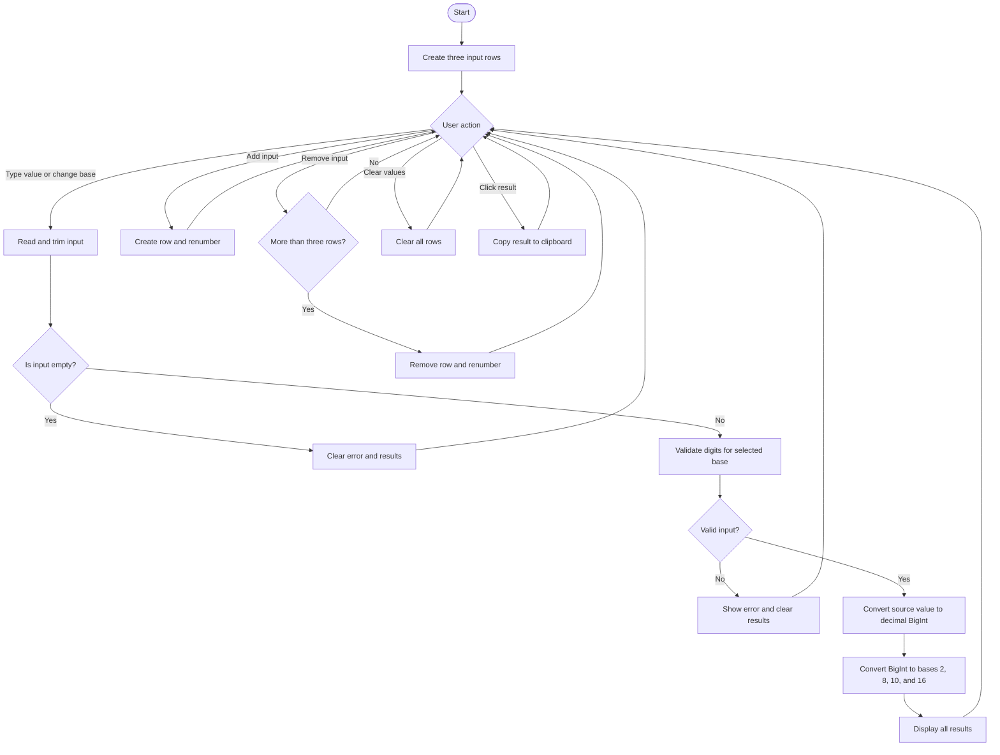

# Number System Converter

A browser-based number system converter for converting values among binary, octal, decimal, and hexadecimal representations. The application is implemented as a self-contained HTML file with embedded CSS and JavaScript.

## System Requirements

### Hardware

- Any computer, tablet, or phone capable of running a modern web browser.
- No special hardware or calculator is required.

### Software

- A modern browser with support for:
  - JavaScript ES2020 or later
  - `BigInt`
  - `String.prototype.startsWith`
  - DOM event handling
  - Clipboard API for copying results when permitted by the browser
- Examples of compatible browsers include current versions of Chrome, Edge, Firefox, and Safari.
- No server, database, package installation, or internet connection is required.
- To run the program, open `app.html` in a browser.

## Supported Number Systems

| Number system | Base | Accepted digits |
|---|---:|---|
| Binary | 2 | `0-1` |
| Octal | 8 | `0-7` |
| Decimal | 10 | `0-9` |
| Hexadecimal | 16 | `0-9`, `A-F`, or `a-f` |

A leading minus sign is accepted for every base. Leading and trailing spaces are removed before validation and conversion.

## Algorithm / Pseudocode

The application converts an input in two stages: the source value is converted to a decimal `BigInt`, then that value is converted to each target base.

### Main conversion algorithm

```text
START

Create a minimum of three input rows.

When the user types a value or changes its selected base:
    Read the input text and selected source base.
    Remove leading and trailing whitespace.

    IF the input is empty:
        Clear the error message and all result fields.
        STOP processing this row.

    Validate the input against the selected base:
        Binary      -> optional '-' followed by digits 0 or 1
        Octal       -> optional '-' followed by digits 0 through 7
        Decimal     -> optional '-' followed by digits 0 through 9
        Hexadecimal -> optional '-' followed by digits 0 through 9 or A through F

    IF validation fails:
        Mark the input as invalid.
        Display the appropriate error message.
        Clear all result fields.
        STOP processing this row.

    Convert the valid source string to a decimal BigInt:
        Handle a leading '-' separately.
        Set result = 0.
        FOR each digit in the input from left to right:
            Convert the digit to its numeric value.
            result = result * source base + digit value.
        Restore the negative sign if necessary.

    For each target base in [2, 8, 10, 16]:
        Convert the decimal BigInt to the target base:
            Return "0" when the value is zero.
            Handle a negative sign separately.
            Repeatedly divide the absolute value by the target base.
            Store each remainder as a digit.
            Read the remainders in reverse order.
            Restore the negative sign if necessary.
        Display the converted value.

END
```

### Input-row management algorithm

```text
When Add Input is clicked:
    Create a new input row.
    Add it to the page.
    Renumber every row.

When a Remove button is clicked:
    IF there are only three rows:
        Do nothing.
    ELSE:
        Remove the selected row.
        Renumber every row.

When Clear Values is clicked:
    Empty every input field.
    Clear every error and result field.

When a result is clicked:
    Copy its displayed value to the clipboard.
    Briefly display "Copied" when copying succeeds.
```

## Flowchart



## Program Implementation

### File structure

```text
number-system-converter/
├── app.html
└── README.md
```

### User interface

The interface is contained in `app.html` and includes:

- A responsive converter workspace.
- Student information fields for the name and course.
- A light/dark theme toggle.
- A subtle transparent grid background.
- Three input rows displayed initially.
- Base selector buttons: `BIN`, `OCT`, `DEC`, and `HEX`.
- Four result fields per row.
- `Add Input`, `Remove`, and `Clear Values` controls.

### Validation implementation

The `BASE_INFO` object defines the accepted pattern for each base:

```javascript
const BASE_INFO = {
  2:  { name: "Binary",      pattern: /^-?[01]+$/i },
  8:  { name: "Octal",       pattern: /^-?[0-7]+$/i },
  10: { name: "Decimal",     pattern: /^-?[0-9]+$/i },
  16: { name: "Hexadecimal", pattern: /^-?[0-9A-Fa-f]+$/i }
};
```

The `validateInput()` function rejects characters that are not legal for the selected base. Empty input is treated as a cleared row rather than an error.

### Conversion implementation

- `baseStringToBigInt(rawValue, base)` converts a string from its selected base into a decimal `BigInt`.
- `bigIntToBaseString(value, base)` uses repeated division and remainders to produce the target-base string.
- `BigInt` is used instead of JavaScript `Number`, allowing conversion of integers larger than the normal safe integer limit.
- The `DIGITS` string, `0123456789ABCDEF`, supplies output symbols for all supported bases.
- `updateRow()` coordinates validation, conversion, error display, and result rendering.

### Event handling

The program uses event delegation on the input container. This allows input, base-selection, result-copy, and remove actions to work for rows created after the initial page load.

## Test Cases

The following cases can be tested directly in a browser by entering a value, selecting its source base, and checking all four result fields.

| Test | Input | Source base | Expected binary | Expected octal | Expected decimal | Expected hexadecimal | Result |
|---:|---|---:|---|---|---:|---|---|
| 1 | `42` | 10 | `101010` | `52` | `42` | `2A` | Pass |
| 2 | `101010` | 2 | `101010` | `52` | `42` | `2A` | Pass |
| 3 | `52` | 8 | `101010` | `52` | `42` | `2A` | Pass |
| 4 | `2A` | 16 | `101010` | `52` | `42` | `2A` | Pass |
| 5 | `-15` | 10 | `-1111` | `-17` | `-15` | `-F` | Pass |
| 6 | `0` | 10 | `0` | `0` | `0` | `0` | Pass |
| 7 | `10201` | 2 | Not generated | Not generated | Not generated | Not generated | Error shown: invalid binary number; allowed digits are `0-1` |
| 8 | `1G` | 16 | Not generated | Not generated | Not generated | Not generated | Error shown: invalid hexadecimal number; allowed digits are `0-9, A-F` |
| 9 | `   ` | 10 | Blank | Blank | Blank | Blank | Row is cleared with no error |
| 10 | `123456789012345678901234567890` | 10 | `11000111011101001000011111111011011000011011100111110000011101110010011100011111` | `10000101011010010` | `123456789012345678901234567890` | `18EE90FF6C373E0EE4E3F0AD2` | Pass; handled with `BigInt` |

Test 10 demonstrates that the large integer is accepted and converted without `Number` precision loss.

### Additional UI tests

| Test | Action | Expected behavior |
|---:|---|---|
| 11 | Load the page | Three input rows appear. Remove buttons are disabled. |
| 12 | Click `Add Input` | A fourth row appears and row labels are renumbered. |
| 13 | With four rows, remove one row | The row disappears and remaining labels are renumbered. |
| 14 | With three rows, click Remove | No row is removed because three is the minimum. |
| 15 | Enter a valid value, then click `Clear Values` | All input and result fields become blank. |
| 16 | Click a populated result | The result is copied to the clipboard and `Copied` appears briefly. |
| 17 | Click the theme button | The interface switches between light and dark themes. |

## Sample Output

### Sample 1: Decimal input

Input:

```text
Source base: Decimal
Value: 42
```

Displayed results:

```text
Binary:      101010
Octal:       52
Decimal:     42
Hexadecimal: 2A
```

### Sample 2: Hexadecimal input

Input:

```text
Source base: Hexadecimal
Value: 2A
```

Displayed results:

```text
Binary:      101010
Octal:       52
Decimal:     42
Hexadecimal: 2A
```

### Sample 3: Invalid binary input

Input:

```text
Source base: Binary
Value: 10201
```

Displayed validation output:

```text
Invalid Binary number. Allowed digits: 0-1.
```

The result fields remain blank until the input is corrected.

## How to Run

1. Open the project folder.
2. Open `app.html` in a modern web browser.
3. Select the source base for an input row.
4. Enter a valid value.
5. Read the four generated representations.
6. Click a result to copy it when needed.

## Limitations and Notes

- The application converts integer values only; fractional values such as `10.5` are rejected.
- Prefixes such as `0b`, `0o`, and `0x` are not accepted because the validator expects digits only, with an optional leading minus sign.
- Theme selection follows the browser's current color-scheme preference when the page loads; it is not persisted after the page is closed.
- Clipboard copying depends on browser permission and support for `navigator.clipboard`.
